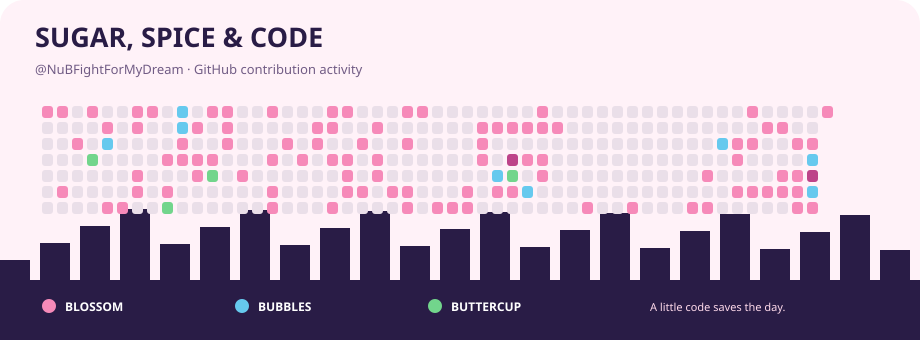

# Chatrphol Ovanonchai (Nine)
- A dumb computer engineering student who tries to overcome obstracles and love to approach my dream.
- Interested Topics in Computer Engineering : AI , Data , Machine Learning , Quantum Computing , Cyber Security
- Interested Topics Outside Computer Engineering : Operation Management , Tech in Environmental Science , Geospatial Data Science & Machine Learning
- Contact : 6730084521@student.chula.ac.th

## 📕 Education Profile
- Graduated from Suankularb Witthayalai School and Triamudom Suksa School in **Arts-Mathematics Degree** (GPAX 3.30)
- Studied **Electrical Engineering (108)** at Chulalongkorn University (GPAX 2.88) .
- Currently Studying Bachelor Degree in Department of **Computer Engineering (52)** at Chulalongkorn University (GPAX 3.00) [Changed major]
- Having Plan to take minors in **Faculty of Industrial Engineering at Chulalongkorn University**

## 🗄️ Teaching Experiences
- 2110101 Computer Programming TAs (Survey Engineering Section 10 & General Sections)
- 2110221 Computer Engineering Essentials AY2025 S2
- 2190101 Computer Programming (ISE)
- 2110215 Programming Methodology (CEDT) (Planned 2026 Semester 2)
- 2100202 Intro Big Data (For Non-CP Students) (Planned 2026 Semester 2)

## Projects
- **Intania Department Calculator** : 1st year web application for Intania Freshman students to calculate score for their dream department (Python , Streamlit) [Link to my GitHub](https://github.com/NuBFightForMyDream/Intania_Department_Calculator_2025)
- **CUEE Camp III (Frontend Developer)** : Develop website used in CUEE Camp III (HTML , CSS (Bootstrap) , JavaScript) [Link to my GitHub](https://github.com/NuBFightForMyDream/CUEE_Camp_III_Website)
- **Find Your Dream Department** : Website for Intania freshman students to get info about their dream department. [Link to my GitHub](https://github.com/NuBFightForMyDream/Find_Your_Dream_Department)

## Related Coursework & Coursework Projects

#### Year 1 (Academic Year 2024)
- 2110101 Computer Programming [Link to Repo](https://github.com/NuBFightForMyDream/2110101-Computer-Programming)
- 2110221 Computer Engineering Essentials [Link to Repo](https://github.com/NuBFightForMyDream/2110221_Computer_Engineering_Essentials)

#### Year 2 (Academic Year 2025)
- 2102203 Probability and Statistics for Electrical Engineering [Link to Repo]()
- 2102208 Programming for Electrical Engineering [Link to Repo](https://github.com/NuBFightForMyDream/2102208_ProgEE_Grader_Problems)
- 2102206 Introduction to Electrical Engineering [Link to Repo](https://github.com/NuBFightForMyDream/2102206_Intro-Electrical-Engineering)
- 2102210 Circuit Theory 
- 2110215 Programming Methodology [Link to Repo](https://github.com/NuBFightForMyDream/2110215_Programming_Methodology)
> Project : 2D Interactive Game with JavaFX : [Link to my project](https://github.com/NuBFightForMyDream/2110215_ProgMeth_FinalProject_PotionMixie)
- 2110201 Computer Engineering Mathematics [Link to Repo](https://github.com/NuBFightForMyDream/2110201_Computer_Engineering_Math_I)

#### Year 2 Free Elective
- 2209261 Basic Programming for NLP [Link to Repo](https://github.com/NuBFightForMyDream/2209261-Basic-Programming-NLP)
- 2108564 Geospatial Data Science and Analysis [Link to Repo](https://github.com/NuBFightForMyDream/2108564_Geospatial-Data-Science-and-Analysis)

#### Year 3 (Academic Year 2026)
- 2110251 Digital Logic Lecture [Link to Repo](https://github.com/NuBFightForMyDream/2110251-Digital-Computer-Logic)
- 2110263 Digital Logic Laboratory [Link to Repo](https://github.com/NuBFightForMyDream/2110263_Digital_Computer_Logic_Laboratory)
- 2110211 Introduction to Data Structure [Link to Repo](https://github.com/NuBFightForMyDream/2110211_Introduction-to-Data-Structure)
- 2110203 Computer Engineering Mathematics II [Link to Repo](https://github.com/NuBFightForMyDream/2110203_Computer_Engineering_Math_II)
- 2107541 Machine Learning for Environmental Applications [Link to Repo](https://github.com/NuBFightForMyDream/2107541_Machine_Learning_For_Environmental_Applications)
- 2110582 AI and Applications [Link to Repo](https://github.com/NuBFightForMyDream/2110582_AI_and_Its_Applications)

## 📄 Resume 
- You can read my resume via [here](https://github.com/NuBFightForMyDream/NuBFightForMyDream/blob/main/CV%20_%20Resume%20Chatrphol%20Internship.pdf)

